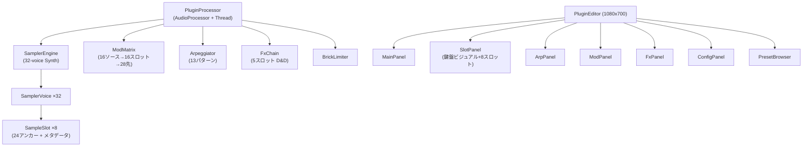

# PicoSampler — 高精度マルチモードサンプラー 実装計画

OtodeskSamplerの全機能を継承しつつ、GranularのGUI/FX/Modulationアーキテクチャを採用した新世代サンプラーVSTプラグイン。

---

## 採用確定設計方針

| 項目 | 決定仕様 |
|------|------|
| ピッチシフトアンカー | **24アンカー**（半音間隔、ルートキー±12半音）＋SignalStretchによる事前レンダリング |
| GUIサイズ | **1080 × 700** ピクセル（Granular横長デザイン＋Layerモード用領域） |
| フィルター方式 | **TPT SVF** (Zavalishin State Variable Filter, 12dB/24dB切替) |
| アルペジエイター | ✅ Granularのアルペジエイターを移植（13パターン、テンポ同期） |
| ポリフォニー | **32ボイス**（Layerモード時最大8スロット同時発音に余裕対応） |
| Layerモード UI | 鍵盤ビジュアル＋数値入力のハイブリッド表示 |
| プリセットブラウザ | ✅ Granular準拠（カテゴリ/検索/お気に入り） |

---

## 全体アーキテクチャ

---

## 変更・追加ファイル仕様

### ビルドシステム (CMake)

#### [NEW] CMakeLists.txt

Granular準拠のCMake構成。
- **プロジェクト名**: `PicoSampler` v1.0.0, OTODESK
- **C++20**, JUCE 8.0系
- **フォーマット**: VST3 + Standalone
- **IS_SYNTH=TRUE**, NEEDS_MIDI_INPUT=TRUE
- **MSVC最適化**: AVX2 SIMD, `/fp:fast`, `/O2` (Release)
- **COPY_PLUGIN_AFTER_BUILD=TRUE**
- **サードパーティ**: `signalsmith-stretch/` を SYSTEM インクルード

---

### サードパーティライブラリ

#### [NEW] Source/third_party/signalsmith-stretch/

Granularから `signalsmith-stretch` ディレクトリをコピー（MITライセンス）。

---

### DSPモジュール

#### [NEW] Source/DSP/SamplerEngine.h / SamplerEngine.cpp
- 32ボイスポリフォニックシンセエンジン
- 3モード（Single / Layer / Random）切り替え
- TPT SVF（HPF/LPF, 12dB/24dB）フィルター搭載

#### [NEW] Source/DSP/SamplerVoice.h / SamplerVoice.cpp
- 24アンカー対応リサンプリング再生（Lagrange3次補間）
- ADSRエンベロープ、クロスフェードループ処理

#### [NEW] Source/DSP/SampleSlot.h / SampleSlot.cpp
- 8スロット独立管理
- **SignalStretch による24アンカー事前生成**（ルート±12半音）
- マルチスレッドバックグラウンド生成

#### [NEW] Source/DSP/PitchAnalyzer.h / PitchAnalyzer.cpp
- 6分析ルート（Standard, KickFFT, HatCym, Loop, Micro, Cepstrum）＋ファイル名解析

#### [NEW] Source/DSP/ModMatrix.h
- 16ソース → 16スロット → 28デスティネーション

#### [NEW] Source/DSP/FxChain.h
- Granular準拠5スロット直列FX（ADAA Saturation / Ensemble Chorus / Tape Delay / Freeze / Shimmer Reverb）

#### [NEW] Source/DSP/Arpeggiator.h / Arpeggiator.cpp
#### [NEW] Source/DSP/ScaleQuantizer.h
- 13パターンアルペジエイター＋17スケール量子化

#### [NEW] Source/DSP/SampleVisualizerData.h
- ロックフリー波形・ボイス可視化データ伝送

---

### プラグインコア & GUI

#### [NEW] Source/PluginProcessor.h / PluginProcessor.cpp
#### [NEW] Source/PluginEditor.h / PluginEditor.cpp
- ウィンドウサイズ: **1080 × 700**
- 6タブ切り替え（Main, Slot, Arp, Mod, Fx, Config）

#### [NEW] Source/GUI/ColorPalette.h
#### [NEW] Source/GUI/ArcDial.h / ArcDial.cpp
#### [NEW] Source/GUI/ValueKnob.h
#### [NEW] Source/GUI/GlowToggle.h
#### [NEW] Source/GUI/WaveformDisplay.h / WaveformDisplay.cpp
#### [NEW] Source/GUI/MainPanel.h / MainPanel.cpp
#### [NEW] Source/GUI/SlotPanel.h / SlotPanel.cpp
- 8スロットカード ＋ 88鍵ミニ鍵盤ビジュアル ＋ 数値入力ハイブリッドUI
#### [NEW] Source/GUI/ArpPanel.h / ArpPanel.cpp
#### [NEW] Source/GUI/ModPanel.h / ModPanel.cpp
#### [NEW] Source/GUI/FxPanel.h / FxPanel.cpp
#### [NEW] Source/GUI/ConfigPanel.h / ConfigPanel.cpp
#### [NEW] Source/GUI/PresetBrowser.h
#### [NEW] Source/Presets/PresetData.h

---

## 実装ステップ

1. **Phase 1: ディレクトリ＆CMake基盤構築**
2. **Phase 2: DSPエンジン・SignalStretch24アンカー・3モード実装**
3. **Phase 3: ModMatrix・FxChain・Arp統合**
4. **Phase 4: GranularデザインGUI (ArcDial, DotWaveform, 鍵盤Visual付きSlotPanel)**
5. **Phase 5: 動作確認・ビルド検証**
