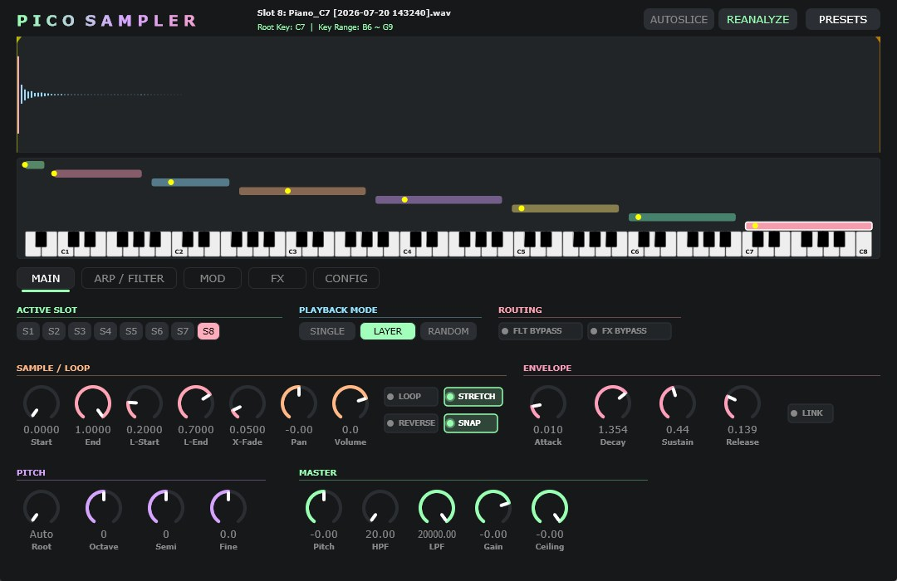
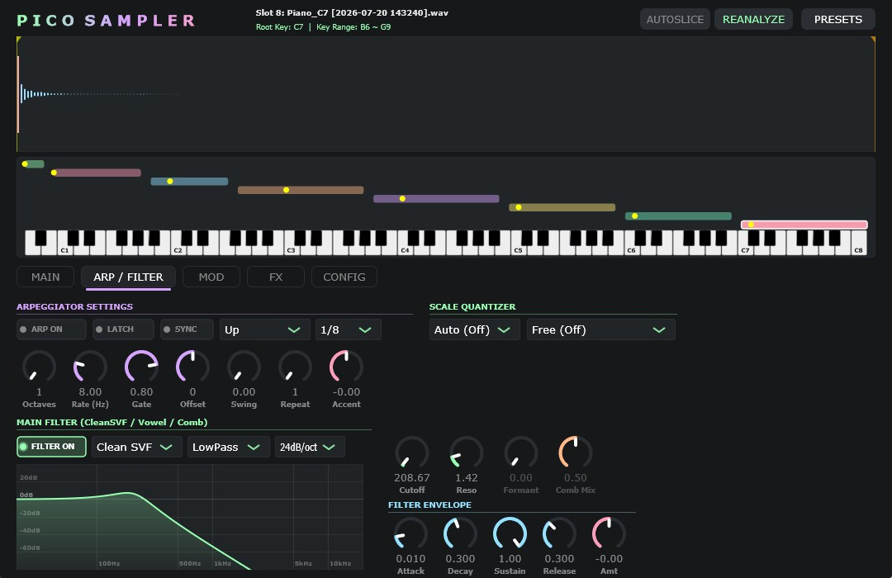
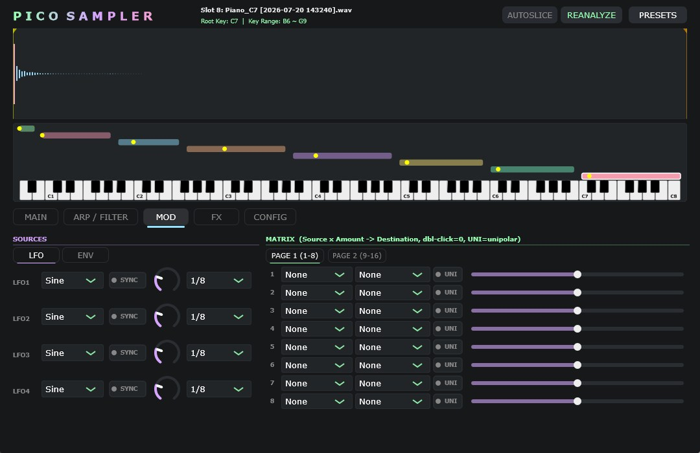
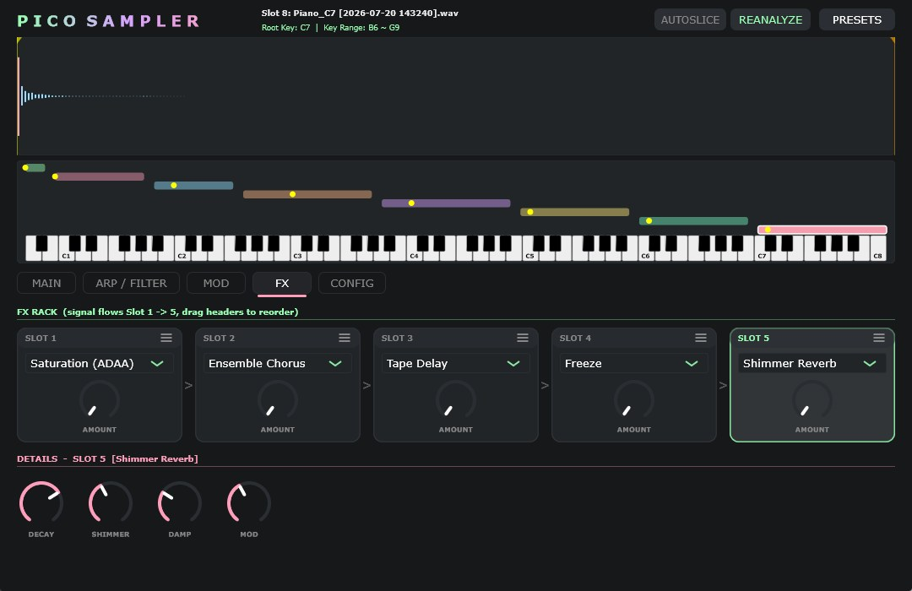
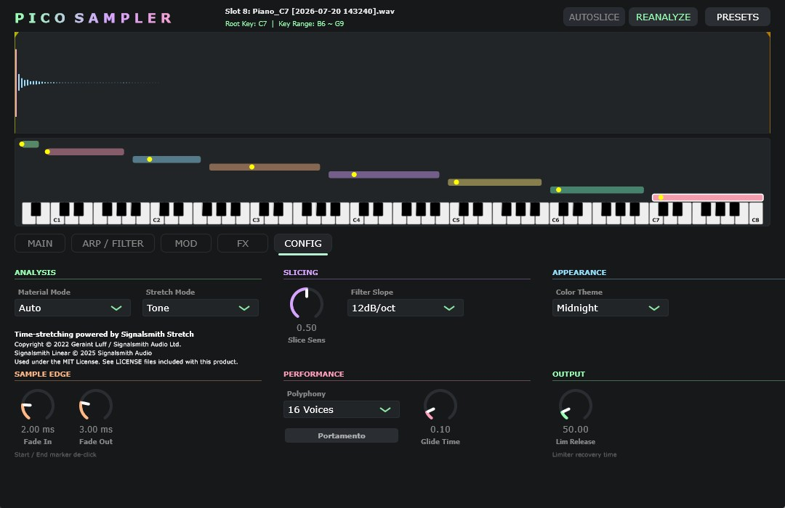

# PICO SAMPLER


##


## Overview

**PICO SAMPLER** is an 8-slot, 32-voice sampler VST3 built around one idea: **sample-accurate editing that never fights you**.

Most samplers quantize their Start/End/Loop parameters to a coarse grid, so zooming into a waveform eventually stops helping — the marker snaps to steps you can see but can't land between. PICO SAMPLER uses fully continuous parameters throughout, with sub-pixel drag tracking and true zero-crossing snapping, so the marker goes exactly where you put it at any zoom level.

On top of that sits a complete instrument: transient-aware auto-slicing, a 49-anchor time-stretch engine that keeps formants intact across four octaves, a 13-pattern arpeggiator with scale quantization, a triple-model filter, a 16-slot modulation matrix, and a drag-to-reorder 5-slot FX rack.

**Design goal:** the precision of a dedicated sample editor, inside a playable instrument.


## Key Features

### Precision Sample Editing

* **Continuous parameters.** Start / End / Loop Start / Loop End / X-Fade are declared with `interval = 0`, giving full 32-bit float resolution instead of the 1/100 grid JUCE's convenience constructor imposes by default. Markers move smoothly at any zoom level, and the knobs stay in sync.
* **Sub-pixel dragging.** Marker drags accumulate in floating-point screen coordinates and divide by the zoom factor, so zooming in makes each pixel finer rather than just magnifying the same steps. Zoom goes up to 100,000×.
* **Guaranteed zero-crossing snap.** With SNAP on, the search range is independent of zoom and continues until a crossing is found, then picks whichever side of the crossing pair is closer to zero. Transient magnetism is measured in *screen pixels*, so the pull feels identical however far you're zoomed in.
* **Edge fades.** Start/End markers landing mid-waveform normally click. A short raised-cosine fade (default 2 ms in, 3 ms out, adjustable 0–200 ms) removes it without audibly shortening the sample. In Loop mode the End fade defers to the loop crossfade so the two never stack.

### 8 Slots × 32 Voices

* **Playback modes:** Single (one slot), Layer (all matching slots at once), Random (pick one per note).
* **Per-slot everything:** sample range, loop points, crossfade, pan, volume, ADSR, pitch, key range, root key, and independent Filter/FX bypass.
* **Key mapping:** drag the coloured bars in the map view to set each slot's key range; the yellow dot marks its root key.
* **Auto root detection** analyses each loaded sample and sets its root key, or override it manually per slot.

### Time-Stretch (Signalsmith)

* **49 pre-rendered anchor buffers** span -24 to +24 semitones. Playback picks the nearest anchor and covers the remainder with interpolation, so transposing four octaves doesn't turn into chipmunk resampling.
* **Four stretch profiles:** Beat / Tone / Texture / Complex.
* **Four analysis modes:** Auto / Crisp / Smooth / Formant.

### Auto-Slice

Drop a loop with AUTOSLICE armed and PICO SAMPLER detects transients, snaps each slice boundary to a zero crossing, and distributes up to 8 slices across the slots. Slice ends are pulled back 1 ms before the next transient so the following hit never bleeds into the previous slot. Slice density follows the Slice Sens control (200 ms → 10 ms minimum spacing), computed from the file's real sample rate.

---

##


### Arpeggiator & Filter

* **13 patterns:** Up, Down, Up-Down, Down-Up, Up-Down (Incl), Converge, Diverge, Pedal Low, Pedal High, As Played, Random, Random Walk, Chord.
* **Tempo-synced or free** (1–30 Hz), with Octaves (1–4), Offset (±12 st), Repeat (1–4), Swing (0–75 %), Gate and bipolar Accent. LATCH holds the chord after you release.
* **Scale Quantizer — 17 scales:** Free, Chromatic, Major, Natural Minor, Major/Minor Pentatonic, Dorian, Lydian, Mixolydian, Phrygian, Harmonic Minor, Melodic Minor, Whole Tone, Octaves & Fifths, Quartal, Sus2/4 Cloud, Diminished. Root key is Auto or fixed.
* **Three filter models:**
  * **Clean SVF** — LowPass / BandPass / HighPass / Notch at 12 or 24 dB/oct.
  * **Vowel Formant** — A-I-U-E-O morphing.
  * **Comb Filter** — with wet mix control.
* **Filter envelope** with its own ADSR and bipolar Amount (±4 octaves of cutoff travel).
* **Live response curve.** The graph redraws as modulation moves, using the exact same maths the DSP applies — what you see is what you hear.

---

##


### Modulation Matrix

* **12 sources:** LFO × 4 (Sine / Triangle / Saw / Square / S&H / Chaos, free 0.05–30 Hz or tempo-synced), ENV × 3 (loopable ADSR), Velocity, Note, Mod Wheel, Random.
* **16 slots** across two pages, each with Source → Destination, bipolar Amount, and a Uni/Bipolar polarity switch.
* **81 destinations** — every sample and loop marker on all 8 slots, per-slot Pan, master pitch, every arpeggiator and filter control, all five FX amounts, and every FX detail parameter.
* **Live range display.** Modulated knobs draw a coloured band showing the reachable range plus a bright dot for the current value, computed through the same function the DSP uses.

---

##


### FX Rack

Five slots in series. Drag any card header to reorder the chain; click a card to edit it in the Detail area below.

* **Saturation (ADAA)** — antiderivative anti-aliased, with **10 algorithms**: Soft Tanh, Hard Clip, Triode, Tape, Transformer, JFET, BJT, Wavefold, Exciter, Cubic. Includes a pre-highpass and output trim.
* **Ensemble Chorus** — Rate, Depth, Width.
* **Tape Delay** — tempo-synced time, Feedback, Damp, and Duck (input-triggered ducking).
* **Freeze** — Size (20–1000 ms), Feedback up to 0.99, Damp.
* **Shimmer Reverb** — Decay, Shimmer, Damp, Mod.

Filter and FX can each be bypassed **per slot**, so one slot can stay dry while another runs the full chain.

---

##


### Config

* **Analysis** — Material Mode and Stretch Mode, plus third-party attribution.
* **Slicing** — Slice Sensitivity and global filter slope.
* **Sample Edge** — Fade In / Fade Out for marker de-click.
* **Performance** — Polyphony (1–32 voices), Portamento with Glide Time.
* **Output** — Limiter release.
* **Appearance** — six colour themes: Midnight, Sakura, Ocean, Forest, Sunset, Mono.


## Parameter Reference

### Sample / Loop (per slot)

| Parameter | Range | Default | Description |
|---|---|---|---|
| Start / End | 0.0 – 1.0 | 0.0 / 1.0 | Playback range, continuous resolution |
| L-Start / L-End | 0.0 – 1.0 | 0.2 / 0.7 | Loop range |
| X-Fade | 0.0 – 0.5 | 0.05 | Loop crossfade, as a fraction of loop length |
| Pan | L100 – C – R100 | C | Slot pan (modulatable) |
| Volume | -36 – +12 dB | 0 dB | Slot level |
| LOOP / STRETCH / REVERSE / SNAP | Off / On | Off / Off / Off / **On** | Per-slot toggles |

### Envelope & Pitch (per slot)

| Parameter | Range | Default | Description |
|---|---|---|---|
| Attack / Decay | 0.001 – 5.0 s | 0.01 / 0.3 s | Amplitude ADSR |
| Sustain | 0.0 – 1.0 | 1.0 | |
| Release | 0.001 – 10.0 s | 0.3 s | |
| LINK | Off / On | Off | Copies the active slot's ADSR to all 8 slots live |
| Root | Auto / C-1 – G9 | Auto | Auto uses the detected root key |
| Octave | -3 – +3 | 0 | |
| Semi | -24 – +24 st | 0 | |
| Fine | -100 – +100 ct | 0 | |

### Master

| Parameter | Range | Default | Description |
|---|---|---|---|
| Pitch | -24 – +24 st | 0 st | Master transposition |
| HPF | 20 – 2000 Hz | 20 Hz | Master high-pass |
| LPF | 200 – 20000 Hz | 20000 Hz | Master low-pass |
| Gain | -36 – +12 dB | 0 dB | Output level |
| Ceiling | -12 – 0 dB | 0 dB | Brick-wall limiter ceiling |

### Arpeggiator

| Parameter | Range | Default | Description |
|---|---|---|---|
| Pattern | 13 types | Up | Note order |
| Rate | 1/1 – 1/32 (sync) or 1–30 Hz | 1/8 | SYNC toggles between them |
| Octaves | 1 – 4 | 1 | |
| Gate | 0.1 – 1.0 | 0.8 | Note length |
| Offset | -12 – +12 st | 0 | |
| Swing | 0 – 75 % | 0 % | |
| Repeat | 1 – 4 | 1 | Retriggers per step |
| Accent | -1.0 – +1.0 | 0.0 | Bipolar velocity accent |

### Filter

| Parameter | Range | Default | Description |
|---|---|---|---|
| Model | Clean SVF / Vowel Formant / Comb | Clean SVF | |
| Type | LP / BP / HP / Notch | LowPass | Clean SVF only |
| Slope | 12 / 24 dB/oct | 12 dB/oct | Clean SVF only |
| Cutoff | 20 – 20000 Hz | 2000 Hz | |
| Reso | 0.1 – 10.0 | 0.707 | |
| Formant | 0.0 – 1.0 | 0.0 | Vowel model only |
| Comb Mix | 0.0 – 1.0 | 0.5 | Comb model only |
| Env Amt | -1.0 – +1.0 | 0.0 | ±4 octaves of cutoff travel |

### FX

| FX | Parameters |
|---|---|
| **Saturation (ADAA)** | ALGO (10 types), DRIVE (1–12×), PRE-HPF (20–2000 Hz), TRIM (±12 dB) |
| **Ensemble Chorus** | RATE (0.05–4 Hz), DEPTH, WIDTH |
| **Tape Delay** | TIME (tempo-synced), FEEDBACK (0–0.95), DUCK, DAMP |
| **Freeze** | SIZE (20–1000 ms), FEEDBACK (0–0.99), DAMP |
| **Shimmer Reverb** | DECAY, SHIMMER, DAMP, MOD |

### Config

| Parameter | Range | Default | Description |
|---|---|---|---|
| Material Mode | Auto / Crisp / Smooth / Formant | Auto | Pitch & feature analysis profile |
| Stretch Mode | Beat / Tone / Texture / Complex | Complex | Signalsmith stretch profile |
| Slice Sens | 0.0 – 1.0 | 0.5 | Higher = more slices (200 ms → 10 ms spacing) |
| Fade In / Out | 0 – 200 ms | 2 / 3 ms | Marker de-click. 0 = hard cut |
| Polyphony | 1 – 32 voices | 16 | |
| Glide Time | 0.0 – 1.0 | 0.1 | Portamento (5–1000 ms) |
| Lim Release | 1 – 500 ms | 50 ms | Limiter recovery |


## Signal Flow

```
MIDI In
   │
   ▼
[Arpeggiator] ──► [Scale Quantizer]
   │
   ▼
┌──────────────────────────────────────────────┐
│  Slot 1..8   (Single / Layer / Random)       │
│    Sample buffer or 49-anchor stretch buffer │
│    Start/End · Loop + X-Fade · Edge Fade     │
│    Lagrange-3 interpolation                  │
│    ADSR · Pan · Slot Gain                    │
└──────────────────────────────────────────────┘
   │
   │  routed per slot by FLT/FX BYPASS
   ▼
[Filter]  Clean SVF / Vowel / Comb  +  Filter ADSR
   │
   ▼
[FX Rack]  5 slots in series, drag to reorder
   Saturation / Chorus / Delay / Freeze / Reverb
   │
   ▼
[Master HPF] ─► [Master LPF] ─► [Gain]
   │
   ▼
[Brick-wall Limiter  (Ceiling / Release)]
   │
   ▼
Output (Stereo)
```

Each slot's **FLT BYPASS** and **FX BYPASS** route it around the corresponding stage, and the four resulting paths are summed at the end — so a dry drum slot and a heavily processed pad slot can coexist in one instance.


## Real-Time Safety

* **Buffer lifetime guard.** Voices hold a raw pointer into a slot's sample buffer for the duration of a block. A reader-count guard makes loading, clearing, and re-analysis wait until every reader has finished before touching the buffer, closing a use-after-free that could crash the host when swapping samples during playback. The audio thread never blocks — if it can't acquire the guard it simply outputs nothing that block.
* **Background loading.** File decoding, pitch analysis, 49-anchor stretch rendering, and re-analysis all run on a dedicated worker thread, never on the audio or message thread.
* **Smoothed parameters.** Filter cutoff, resonance, and output gain use `LinearSmoothedValue` ramps; portamento is an exponential glide.
* **Bounded feedback.** Delay feedback tops out at 0.95, Freeze at 0.99, and the output stage ends in a brick-wall limiter.
* **Marker safety.** Start/End and Loop points are clamped against each other with a minimum span, so no parameter combination can produce a zero-length or inverted read region.


## 📚 Manual

Quick manuals covering every tab and parameter, plus starting-point settings and troubleshooting:

[  ](Source/Assets/PicoSampler_Manual_EN.md)
[  ](Source/Assets/PicoSampler_Manual_JP.md)


## Installation

1. Download `PicoSampler.vst3` from the [Releases](https://github.com/OTODESK4193/PicoSampler/releases/latest)  page.
2. Copy it to your VST3 directory:
   ```
   C:\Program Files\Common Files\VST3\
   ```
3. Rescan plugins in your DAW.

### Build Requirements

* **JUCE** 8.0.x — place at `C:/JUCE` or update `JUCE_PATH` in `CMakeLists.txt`
* **CMake** 3.22 or higher
* **Visual Studio** 2022 (MSVC, C++20)

```bash
cmake -B build -DJUCE_PATH=C:/JUCE
cmake --build build --config Release
```


## System Requirements

* **OS:** Windows 10 / 11 (64-bit)
* **Format:** VST3 / Standalone
* **Tested Host:** Ableton Live 11 / 12

> ⚠️ **Compatibility Notice:** Verified operation is confirmed in **Ableton Live**. Other DAWs may work but are currently unverified.


## Tips

* **Tight one-shot drums:** SNAP on, drag Start to the transient, Fade In 0 ms and Fade Out 3 ms. Zero-crossing snap keeps the attack intact while killing the click on release.
* **Seamless sustained loop:** turn LOOP on, place L-Start and L-End on zero crossings with SNAP, then raise X-Fade to about 0.1. Fade Out is automatically skipped in loop mode.
* **Chopping a breakbeat:** arm AUTOSLICE before dropping the file. Slices land on all 8 slots mapped from C1 upward, each ending 1 ms before the next transient.
* **Playable pad from a short sample:** STRETCH on, Stretch Mode = Tone or Complex, LOOP on with a long X-Fade. The 49 anchors keep formants stable across four octaves.
* **Auto-pan movement:** assign an LFO to `S1/Pan` in the MOD MATRIX. Per-slot Pan destinations sit at the end of the destination list.
* **Evolving filter:** assign ENV 1 (with Loop on) to Filter Cutoff, then watch the response curve — it moves in real time with the modulation.
* **Precision knob work:** hold **Ctrl** while dragging to cover the full range fast, or **Shift** for sample-level fine tuning. Press the modifier *before* grabbing the knob.


## License

This project is licensed under the GNU Affero General Public License v3.0 (AGPLv3) — see [LICENSE](LICENSE) for details.

This software is built with the **JUCE 8** framework. In accordance with JUCE 8's open-source licensing terms, this entire project is distributed under the AGPLv3.

### Third-Party

Time-stretching is powered by **Signalsmith Stretch**, used under the MIT License.

* Signalsmith Stretch — Copyright © 2022 Geraint Luff / Signalsmith Audio Ltd. — [LICENSE](Source/third_party/signalsmith-stretch/LICENSE-stretch.txt)
* Signalsmith Linear — Copyright © 2025 Signalsmith Audio — [LICENSE](Source/third_party/signalsmith-stretch/signalsmith-linear/LICENSE-linear.txt)

> When distributing binaries, include both MIT licence files alongside the plugin — the MIT terms require the copyright and permission notices to accompany every copy, not just the source repository.


## Credits

**Developer:** @kijyoumusic (OTODESK)

**Framework:** JUCE 8.0.x

**Target DAW:** Ableton Live 11 / 12

**DSP References:**
- Signalsmith Audio — *Signalsmith Stretch* (phase-vocoder time-stretching)
- McLeod & Wyvill — *"A Smarter Way to Find Pitch"* (MPM, 2005)
- Zavalishin — *"The Art of VA Filter Design"* (TPT/SVF topology)
- Parker, Zavalishin & Le Bivic — *"Reducing the Aliasing of Nonlinear Waveshaping Using Continuous-Time Convolution"* (ADAA, 2016)


## Support

* **Social / Demo:** [@kijyoumusic](https://x.com/kijyoumusic)
* [](https://otodesk4193.github.io/OTODESK_SITE/)
